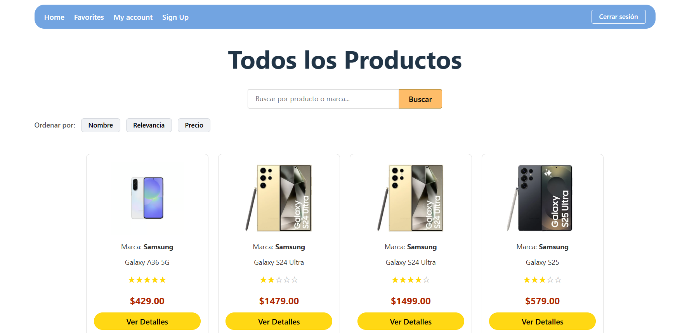
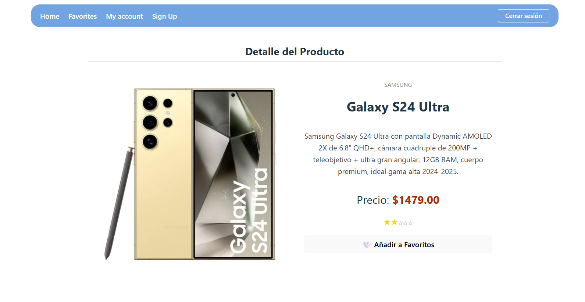
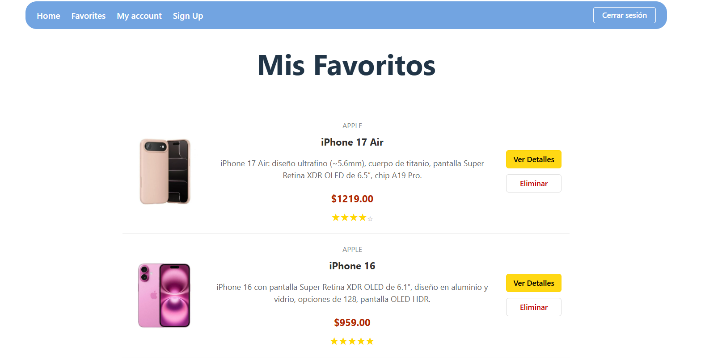

📱 app_full_stack — Tienda Online de Móviles

Un proyecto Full Stack desarrollado como aplicación de tienda online de dispositivos móviles.
Incluye sistema de autenticación, exploración de productos, vista detallada, gestión de favoritos, búsqueda y filtrado.
Desarrollado con React + Vite en el frontend y Node.js + Express + PostgreSQL en el backend.

🚀 Características Principales

•   🔐 Autenticación completa: Login y Registro con JWT y contraseñas encriptadas con bcrypt.

•   🛒 Catálogo de móviles: Listado de productos con vista detalle.

•   ⭐ Favoritos: Añadir y eliminar favoritos por usuario.

•   🔍 Búsqueda: Filtrar móviles por nombre o palabras clave.

•   🎚️ Filtros avanzados: Precio, proveedor, relevancia, etc.

•   📱 Vista de detalle: Imagen, precio, descripción, proveedor y valoración.

•   ⚡ Frontend rápido usando Vite y React Router.

•   🗄️ Backend estructurado con Express y PostgreSQL.

•   🔐 Protección de rutas privadas mediante JWT.

🧩 Arquitectura del Proyecto

🛠️ Tecnologías Utilizadas
Frontend

•   React

•   Vite

•   React Router

•   Axios

Backend

•   Node.js

•   Express

•   PostgreSQL

🗃️ Base de Datos (SQL — PostgreSQL)

Tablas principales

•   Usuarios

•   Productos

•   Favoritos

•   Proveedores

▶️ Instalación y Ejecución
📌 1. Clonar el proyecto
git clone https://github.com/ArturMelik/app_full_stack

cd app_full_stack

📌 2. Instalar dependencias del proyecto

Desde la carpeta raíz:

npm install

📌 3. Arrancar frontend + backend simultáneamente
npm run dev

🔑 Variables de Entorno (backend)

Crea un archivo .env dentro de backend/ con:

PORT=3001
DB_USER=postgres
DB_PASSWORD=tu_password
DB_HOST=localhost
DB_NAME=nombre_db
JWT_SECRET=tu_secreto

(Modifica según tu configuración)

🔌 Endpoints principales (API)

(Opcional, completa según tu backend real)

Usuarios

•   POST /signup

•   POST /login

Productos

•   GET /products

•   GET /products/:id

Favoritos

•   GET /favorites/:userId

•   POST /favorites

•   DELETE /favorites/:id

🖼️ Capturas de Pantalla

🧑‍💻 Autor

Artur Melik Adamyan
Proyecto Full Stack — 2025